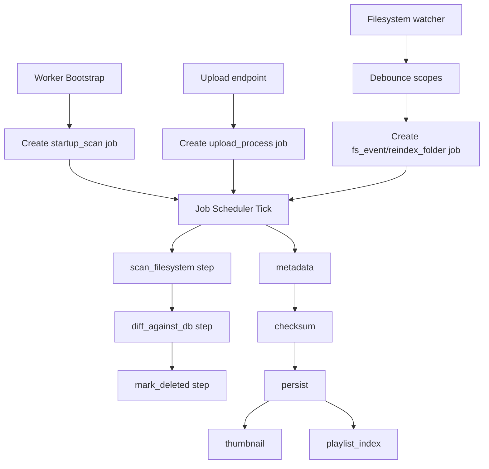

# Scan Files Job System

## Notes
- `StartFileProcessingPipeline` monolith was retired.
- `ScanDirWorker` was retired.
- Legacy queue tasks (`ScanFiles` and `ScanDir`) are now adapters that enqueue jobs.
